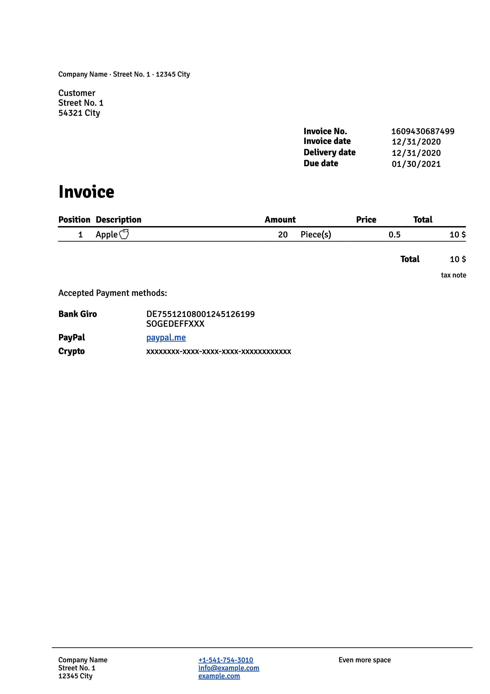

= Invoice Generator

:toc:

Simple tool to generate invoices right from your browser by using its print API for PDF saving (see https://devidwolf.github.io/invoice/[Demo]).

== Features
- complete manipulation of invoice items (edit, clone, delete, order)
- automatic calculations for price fields
- custom inline html (e.g. use hyperlinks for: `mailto:`, `tel:`, …)
- load different languages

== How to …

=== … use the toolbar

|===
|Button |Action

|PDF    |call print dialog
|🖩      |calculate item position numbers, item prices and total price
|===

Working with the invoice item selected with the position input:

|===
|Button |Action

|copy   |duplicate selected position
|🗑️     |delete selected position
|↑      |move selected position upwards
|↓      |move selected position downwards
|===

=== … save static invoice data
Some data like your address, contact as well as paying details are pretty much static, here is how you can save them, so you do not have to retype everything after a page refresh. To do so, update the JSON inside `/languages/prefill.js` to fit your needs.

=== … add and set translations
. duplicate an existing translation file in `/languages`
. rename it, e.g. `lang_en.js`
. write actual translations in JSON-Format
. update path of import statement in `/js/lang.js` to match the new filename

=== … adjust page format
By default sizes and layouts match paper format _DIN A4_ and page margins follow _DIN 5008_. For other standards, change CSS variables in `/css/variables.css` to your preferred sizes for page dimensions, margins etc..

=== … modify logic for default invoice no. and dates
Per default the invoice number is the current UNIX timestamp and invoice as well as delivery date equal todays date, while the due date is 30 days in the future from today. All that can be modified in `/js/init.js`.

== Notes
Best experience in Chromium based browsers (Chrome, Edge, Opera), recommended printing settings for these browsers are as following:

|===
|Option       |Value

|Paper size   |A4
|Margins      |None
|===
